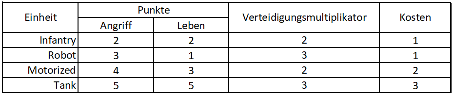
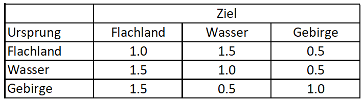

# Heute Kein König!
Willkommen bei Heute Kein König!  $\mapsto$ einem Player vs Player Mini-Battler.

Dieser Guide soll neuen Spielern den Einstieg erleichtern, sodass diese so schnell wie möglich en route zum Profi sind.

## Ziel des Spiels
... ist es mit seinen eigenen Einheiten, alle Einheiten des Gegners zu vernichten. Dazu bewegt man seine Einheiten in die von gegnerischen Einheiten benachbarten Felder und greift diese an. 

## Spielfluss
Beim Spielstart wählen beide Spieler Ihre Einheiten und danach gehts auch schon los. Abwechselnd, beginnend mit Spieler 1, können die Spieler ihre Einheiten Bewegen. Wenn das Ziel einer Bewegung ein Feld mit einer gegnerischen Einheit ist, wird ein Angriff auf diese ausgeführt.

Bei Angriffen ist zu beachten: diese können nicht diagonal ausgeführt werden. Man sollte sich also den Weg zum Gegner gut überlegen um auch die Terrainvorteile nutzen zu können.

### Kosten für Aktionen 
... ergeben sich wie folgt:
Bewegungen $\Rightarrow$ Anzahl der bewegten Felder in Token
Angriffe $\Rightarrow$ Jeweils ein Token

### Ausgang eines Angriffes
... wird wie folgt ermittelt:
Angriffspunkte $AP$ und deren Angriffsmultiplikator $AP_{mult}$
Lebenspunkte  $HP$ und deren Verteidigungsmultiplikator $HP_{mult}$

Die neuen Lebenspunkte der Einheit sind $HP_{new} = HP * ( (HP*HP_{mult}-(AP*AP_{mult})) / (HP*HP_{mult}) )$

Falls $HP_{new}\leq0$ dann überlebt die angegriffene Einheit nicht.

## Einheiten
Es gibt vier verschiedene Einheiten mit jeweils verschiedenen Eigenschaften:

## Terrains
Bei Angriffen wird abhängig vom Terrain bei Ursprung und Ziel des Angriffs ein Multiplikator auf die Angriffspunkte angewandt wie folgt:

## Tokens
Der Basis-Tokenwert beträgt 8. Von diesem Wert werden die Kosten der Einheiten abgezogen. Der sich daraus ergebende Wert wird dem Spieler pro Runde gut geschrieben.

Die zu jeder zeit maximale Anzahl an Tokens die sich im Besitz eines Spielers befinden können ist das doppelte von dem was diesem pro Runde gutgeschrieben wird. Falls nach Gutschrift der Tokens pro Runde mehr als dieser Wert herauskommt, gehen die Tokens welche zu viel sind verloren.

### Rechenbeispiel
Ausgewählte Einheiten und Kosten:
- infantry, 1 Token
- robot, 1 Token
- motorized, 2 Tokens

Die Tokens welche pro Runde gutgeschrieben werden sind: $8-1-1-2=4$.
Die maximale Anzahl an Tokens im Besitz des Spielers: $2\times 4=8$.

Falls bei Beendung des Zuges mehr als 4 Tokens übrig sind wird nur bis 8 Tokens aufgestockt und der Rest geht verloren.

## Schlusswort
Abschließend lässt sich nur sagen: **Danke fürs spielen!**
Wir hoffen, dass euch das Spiel eine Menge Spaß und Freude bringt.

_Ein Spiel von Maximilian Wagner und Dennis Haupt_
